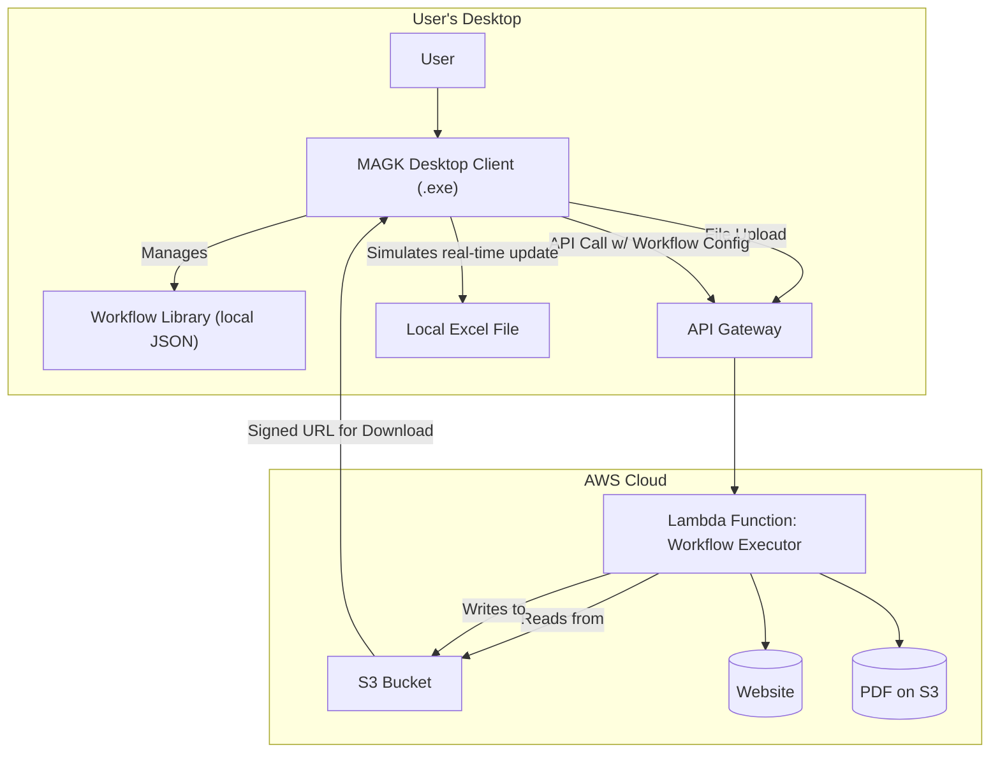
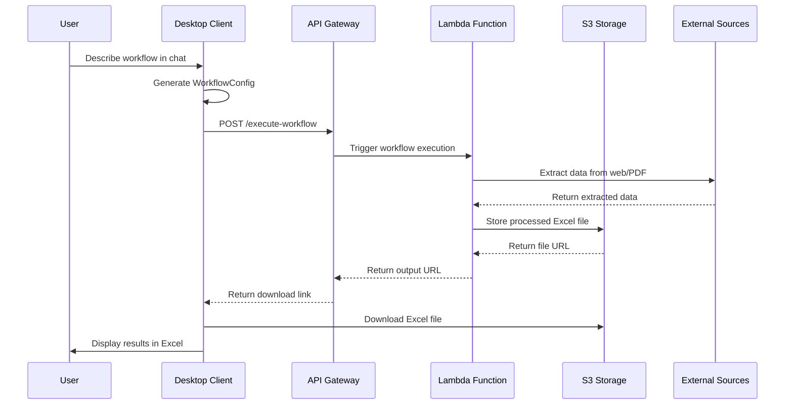
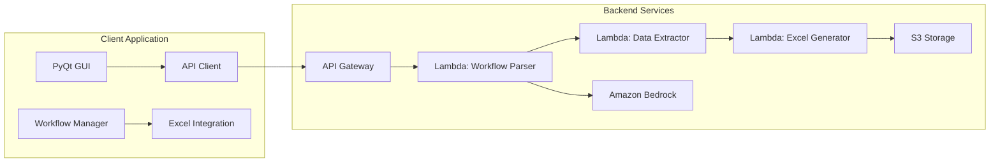

# MAGK Excel - AI-Powered Financial Data Automation

[](https://www.python.org/downloads/)
[](https://www.microsoft.com/en-us/windows)

## 📋 Project Overview

MAGK Excel is an AI-powered desktop application designed to revolutionize how professionals handle repetitive data extraction and processing tasks. By combining natural language processing with deep Excel integration, MAGK transforms complex, multi-step workflows into simple, one-click, reusable automation tools accessible to users with zero programming knowledge.

### 🎯 Key Features

- **Conversational Workflow Builder**: Define automation tasks using natural language
- **Web & PDF Data Extraction**: Extract tabular data from websites and PDF documents
- **Excel Integration**: Seamless manipulation and generation of Excel files
- **Customizable Tool Generation**: Create standalone, clickable automation programs
- **Zero Programming Knowledge Required**: Designed for non-technical professionals

### 🚀 Value Proposition

MAGK addresses the critical pain point that professionals spend excessive time on manual, repetitive tasks like:
- Navigating websites to find specific reports and data
- Manually downloading PDFs and Excel files
- Copy-pasting data with high error rates
- Consolidating information across multiple sources

By automating these workflows, MAGK enables users to focus on high-value activities like analysis, modeling, and generating insights. Unlike general-purpose AIs, MAGK creates permanent, customizable automation tools that become reusable assets for recurring tasks.

## 🏗️ Architecture

MAGK is built as a hybrid client-server application with the following architecture:

### High-Level Architecture



### System Architecture Flow



### Component Architecture



### Technology Stack

| Component | Technology | Purpose |
|-----------|------------|---------|
| **Client** | Python 3.10+ | Desktop application logic |
| **GUI** | PyQt 6.x | Native desktop interface |
| **Backend** | AWS Chalice | Serverless API framework |
| **AI** | Amazon Bedrock | Natural language processing |
| **Web Scraping** | Selenium 4.x | Dynamic website automation |
| **PDF Parsing** | PyMuPDF 1.23.x | Document text extraction |
| **Excel** | openpyxl 3.1.x | Spreadsheet manipulation |
| **Packaging** | PyInstaller 6.x | Windows executable creation |

## 👥 Contributors

### Current Team

**Jack Luo**  
**Operating System:** Windows 11  
**Python Version:** 3.13.5

**Developer:** Kian Hong  
**Operating System:** macOS 15.3.1  
**Python Version:** 3.13

**Karthik**  
**Operating System:** macOS  
**Python Version:** ???

**Arman**  
**Status:** Not yet onboarded

**Kevin**  
**Operating System:** macOS 
**Python Version:** ???

### Contributing

We welcome contributions! Please see our [Contributing Guidelines](CONTRIBUTING.md) for details on:
- Code style and standards
- Pull request process
- Issue reporting
- Development setup

## 🚀 Getting Started

### Prerequisites

- **Python 3.10 or higher**
- **Microsoft Excel** (2007 or later, including .xls format support)
- **Windows 10/11** (primary target platform)
- **AWS Account** (for backend services)

### Installation

#### Windows

1. **Clone the repository**
   ```bash
   git clone https://github.com/your-org/magk-excel.git
   cd magk-excel
   ```

2. **Set up Python virtual environment**
   ```bash
   python -m venv venv
   venv\Scripts\activate
   ```

3. **Install client dependencies**
   ```bash
   cd apps/client
   pip install -r requirements.txt
   ```

4. **Install server dependencies**
   ```bash
   cd ../server
   pip install -r requirements.txt
   ```

5. **Configure AWS credentials**
   ```bash
   aws configure
   ```

6. **Deploy backend services**
   ```bash
   chalice deploy
   ```

7. **Run the application**
   ```bash
   cd ../client
   python src/main.py
   ```

#### macOS

1. **Clone the repository**
   ```bash
   git clone https://github.com/your-org/magk-excel.git
   cd magk-excel
   ```

2. **Set up Python virtual environment**
   ```bash
   python3 -m venv venv
   source venv/bin/activate
   ```

3. **Install dependencies**
   ```bash
   cd apps/client
   pip install -r requirements.txt
   cd ../server
   pip install -r requirements.txt
   ```

4. **Configure AWS credentials**
   ```bash
   aws configure
   ```

5. **Deploy and run**
   ```bash
   chalice deploy
   cd ../client
   python src/main.py
   ```

#### Linux/Unix

1. **Clone the repository**
   ```bash
   git clone https://github.com/your-org/magk-excel.git
   cd magk-excel
   ```

2. **Set up Python virtual environment**
   ```bash
   python3 -m venv venv
   source venv/bin/activate
   ```

3. **Install system dependencies** (Ubuntu/Debian)
   ```bash
   sudo apt-get update
   sudo apt-get install python3-dev python3-pip
   sudo apt-get install libgl1-mesa-glx libglib2.0-0
   ```

4. **Install Python dependencies**
   ```bash
   cd apps/client
   pip install -r requirements.txt
   cd ../server
   pip install -r requirements.txt
   ```

5. **Configure and run**
   ```bash
   aws configure
   chalice deploy
   cd ../client
   python src/main.py
   ```

### Development Setup

1. **Install development dependencies**
   ```bash
   pip install -r requirements-dev.txt
   ```

2. **Set up pre-commit hooks**
   ```bash
   pre-commit install
   ```

3. **Run tests**
   ```bash
   pytest
   ```

## 📂 Development Scripts

The project includes helper scripts organized in the `scripts/` directory:

### Script Organization

```
scripts/
├── setup/          # Environment setup and configuration
│   ├── check-env.bat      # Windows: Pre-setup environment verification
│   ├── setup.bat          # Windows: Create venv and install dependencies
│   └── setup.sh           # Linux/Mac: Create venv and install dependencies
│
└── testing/        # Testing and validation scripts
    ├── test.bat           # Windows: Run pytest test suite
    ├── test_python.bat    # Windows: Debug Python/venv detection
    └── verify_fix.bat     # Windows: Verify setup fixes
```

### Using Development Scripts

#### Initial Setup
1. **Check your environment** (Windows only):
   ```bash
   cd apps/server
   ..\..\scripts\setup\check-env.bat
   ```

2. **Run setup**:
   - Windows: `..\..\scripts\setup\setup.bat`
   - Linux/Mac: `../../scripts/setup/setup.sh`

#### Running Tests
From the app directory (e.g., `apps/server`):
- Windows: `..\..\scripts\testing\test.bat`
- Linux/Mac: `pytest tests/ -v`

### Virtual Environment Strategy

Each app maintains its own virtual environment:
- Server: `apps/server/venv/`
- Client: `apps/client/venv/`

This approach ensures:
- Dependency isolation between apps
- No version conflicts
- Standard Python project structure
- Easy CI/CD integration

### Cross-Platform Notes

- Windows scripts use `.bat` extension and `py` command
- Linux/Mac scripts use `.sh` extension and `python3` command
- Virtual environments have different structures:
  - Windows: `venv\Scripts\activate.bat`
  - Linux/Mac: `venv/bin/activate`

## 📁 Project Structure

```
magk-excel/
├── apps/
│   ├── client/                 # Desktop client application
│   │   ├── src/
│   │   │   ├── ui/            # PyQt UI components
│   │   │   ├── api/           # Backend API client
│   │   │   ├── workflows/     # Local workflow management
│   │   │   └── main.py        # Application entry point
│   │   └── tests/
│   └── server/                # AWS serverless backend
│       ├── app.py             # Chalice application
│       ├── chalicelib/        # Backend modules
│       │   ├── excel_integration/
│       │   ├── excel_parsers/
│       │   ├── pdf_parsers/
│       │   └── streaming/
│       └── requirements.txt
├── docs/                      # Project documentation
│   ├── brief.md              # Project brief
│   ├── architecture.md       # Technical architecture
│   ├── prd.md               # Product requirements
│   └── ux.md                # UX specifications
├── web-bundles/              # AI agent configurations
└── README.md
```

## 🔧 Configuration

### Environment Variables

Create a `.env` file in the project root:

```env
# AWS Configuration
AWS_REGION=us-east-1
AWS_ACCESS_KEY_ID=your_access_key
AWS_SECRET_ACCESS_KEY=your_secret_key

# Application Configuration
MAGK_ENVIRONMENT=development
MAGK_LOG_LEVEL=INFO
```

### AWS Services Setup

1. **Create S3 bucket for file storage**
2. **Set up API Gateway with API keys**
3. **Configure Lambda functions with appropriate IAM roles**
4. **Set up CloudWatch for logging**

## 🧪 Testing

### Running Tests

```bash
# Run all tests
pytest

# Run specific test categories
pytest tests/unit/
pytest tests/integration/
pytest tests/e2e/

# Run with coverage
pytest --cov=apps
```

### Test Structure

- **Unit Tests**: Individual component testing
- **Integration Tests**: API and service integration
- **E2E Tests**: Full workflow testing
- **Performance Tests**: Load and stress testing

## 📦 Deployment

### Building Executable

```bash
# Build Windows executable
pyinstaller --onefile --windowed apps/client/src/main.py
```

### AWS Deployment

```bash
# Deploy backend services
chalice deploy

# Update environment
chalice deploy --stage production
```

## 🐛 Troubleshooting

### Common Issues

1. **PyQt Installation Issues**
   ```bash
   # On macOS
   brew install qt
   pip install PyQt6
   ```

2. **AWS Credentials**
   ```bash
   aws configure list
   aws sts get-caller-identity
   ```

3. **Excel Integration**
   - Ensure Microsoft Excel is installed
   - Check file permissions
   - Verify .xls format compatibility

### Getting Help

- **Issues**: [GitHub Issues](https://github.com/your-org/magk-excel/issues)
- **Documentation**: [Project Wiki](https://github.com/your-org/magk-excel/wiki)
- **Discussions**: [GitHub Discussions](https://github.com/your-org/magk-excel/discussions)

## 📄 License

This project is licensed under the MIT License - see the [LICENSE](LICENSE) file for details.

## 🙏 Acknowledgments

- **BMad Team**: For the AI-driven development framework
- **AWS Chalice**: For the serverless framework
- **PyQt**: For the desktop GUI framework
- **Financial Analysts**: For domain expertise and feedback

---

**Note**: This is a proof-of-concept demo project. For production use, additional security, compliance, and scalability considerations should be addressed.