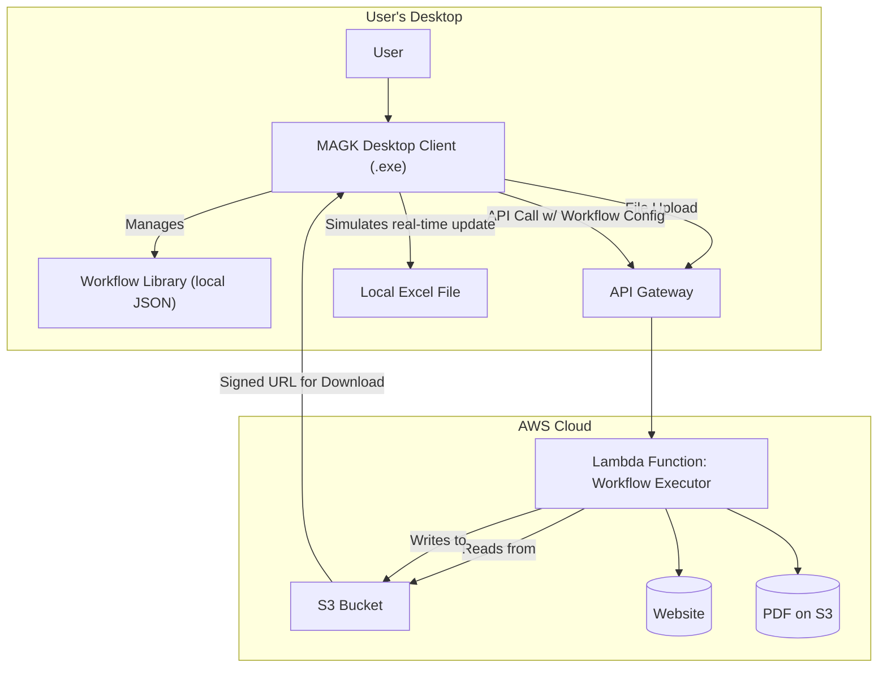

# MAGK Demo Fullstack Architecture Document

## Introduction

This document outlines the complete fullstack architecture for the MAGK Demo. It covers the backend logic, frontend implementation, and their integration. It serves as the single source of truth for AI-driven development, ensuring consistency across the entire technology stack. This architecture is based on the approved PRD and the UI/UX Specification.

**Architectural Pivot:** Based on a review of the project's timeline and computational requirements, the architecture has been updated from a local-only model to a client-server model. This change addresses feasibility concerns while maintaining the core user experience and security principles.

### Change Log

| Date | Version | Description | Author |
| --- | --- | --- | --- |
| July 28, 2025 | 1.0 | Initial architecture based on PRD and UI/UX Spec. | Winston (Architect) |
| July 28, 2025 | 2.0 | Revised to a client-server model with AWS backend. | Winston (Architect) |

## High Level Architecture

### Technical Summary

The MAGK Demo is architected as a hybrid client-server application. A lightweight Python desktop client (PyQt) provides the chat UI and a library for saved workflows. The heavy lifting of workflow generation (using Amazon Bedrock) and data extraction is offloaded to a secure, serverless AWS backend. This separation ensures the user's machine remains responsive. For the MVP, workflows are saved to a local JSON file and run from within the main MAGK application, which preserves the "one-click" reuse goal while dramatically simplifying implementation.

### Platform and Infrastructure Choice

- **Client Platform:** Windows Desktop.
- **Cloud Platform:** AWS.
- **Key Services:**
    - AWS Lambda: To run the data extraction and processing logic.
    - AWS API Gateway: To create a secure REST API for the client.
    - AWS S3: To temporarily store uploaded source files (e.g., PDFs) and generated output files.
    - Amazon Bedrock: To provide the AI inference for chat parsing and UI generation logic.

### Repository Structure

- **Structure:** Monorepo. This will contain the code for both the desktop client and the serverless backend, simplifying dependency management and development workflow.

### High Level Architecture Diagram



### Architectural Patterns

- **Client-Server:** Separates the UI (client) from the intensive data processing (server).
- **Serverless:** Utilizes cloud functions (Lambda) to eliminate server management.
- **Request-Response:** The client will send a request and receive a final result, simplifying the flow for the MVP.

## Tech Stack

| Category | Technology | Version | Purpose | Rationale |
| --- | --- | --- | --- | --- |
| Client Language | Python | 3.10.x | Desktop client application logic and UI. | Consistent with backend; good GUI options. |
| GUI Framework | PyQt | 6.x | Desktop user interface for the client app. | Provides robust, native-looking UI controls. |
| Backend Language | Python | 3.10.x | Serverless function logic. | Strong ecosystem for data extraction. |
| Backend Framework | AWS Chalice | 1.31.x | Rapidly create and deploy serverless Python APIs. | Simplifies Lambda/API Gateway deployment. |
| AI Inference | Amazon Bedrock | N/A | Natural language understanding and UI logic. | Managed, powerful AI service for core logic. |
| Web Scraping | Selenium | 4.x | Browser automation and web data extraction. | Handles dynamic websites effectively. |
| PDF Parsing | PyMuPDF | 1.23.x | Extracting text and tables from PDF documents. | Excellent performance and accuracy. |
| Excel Manipulation | openpyxl | 3.1.x | Creating and writing to .xlsx files. | Reliable and feature-rich for modern Excel. |
| Backend Testing | pytest | 8.x | Unit testing for the Chalice backend. | Industry standard for Python testing. |
| Packaging | PyInstaller | 6.x | Bundling the Python client into a single .exe. | Standard tool for creating executables. |

Export to Sheets

## Data Models

### WorkflowConfig (API & Internal Model)

**Purpose:** To represent a user's defined workflow. This object is saved in the local JSON library and sent to the backend API for execution.

**Python Dataclass (Illustrative):**

Python

```python
from dataclasses import dataclass
from typing import List, Literal, Dict

@dataclass
class WorkflowConfig:
  id: str # Unique ID for the workflow
  name: str # User-defined name
  sourceType: Literal['web', 'pdf']
  sourceUri: str # URL or a fileId from an S3 upload
  dataIdentifier: str # e.g., table ID or text to find
  uiControls: List[Dict[str, str]] # e.g., [{'type': 'date-range', 'label': 'Select Dates'}]

```

## Unified Project Structure

```
magk-demo/
├── apps/
│   ├── client/           # The desktop client application
│   │   ├── src/
│   │   │   ├── ui/       # PyQt UI components
│   │   │   ├── api/      # Client-side logic for calling the backend
│   │   │   ├── workflows/ # Logic for managing the local workflow library
│   │   │   └── main.py   # Client entry point
│   │   └── tests/
│   └── server/           # The serverless backend
│       ├── app.py        # Chalice app definition (routes, logic)
│       ├── chalicelib/   # Shared code for the backend (e.g., automation modules)
│       └── requirements.txt
├── docs/
│   ├── prd.md
│   └── architecture.md
└── README.md
```

## API Specification

The REST API is simplified to two main endpoints.

- **POST /uploads**
    - **Purpose:** To get a pre-signed URL for uploading a source file (like a PDF).
    - **Request Body:** `{ "fileName": "alibaba-report.pdf" }`
    - **Response:** `{ "uploadUrl": "<https://s3>...", "fileId": "..." }`
- **POST /execute-workflow**
    - **Purpose:** To trigger the data extraction workflow.
    - **Request Body:** The `WorkflowConfig` object in JSON format. If a file was uploaded, `sourceUri` will contain the `fileId`.
    - **Response:** `{ "outputUrl": "<https://s3>..." }` (A pre-signed URL to download the generated Excel file).

## Security and Performance

- **Security:** Communication is over HTTPS. The API Gateway will be secured using API Keys for the MVP. Files uploaded to S3 will have a short-lived lifecycle policy (e.g., deleted after 1 hour) to ensure no user data is retained.
- **Performance:** The UI remains responsive by offloading heavy processing to the backend. AWS Lambda can scale automatically. For the demo, Provisioned Concurrency (set to 1) will be used to keep one function instance "warm," mitigating cold start delays.

## Testing Strategy

- **Unit Testing (Primary for MVP):** In line with the PRD, automated unit tests, created by AI agents using `pytest`, will be implemented for the core backend modules in `chalicelib`. This ensures foundational reliability.
- **Manual Testing:** The primary focus will be end-to-end manual testing of the three core demo use cases to ensure a flawless presentation.

## Error Handling Strategy

- **Client-Side:** The client will handle standard HTTP errors (e.g., 4xx, 5xx) and display a user-friendly error message in a simple dialog box.
- **Server-Side:** The Chalice application will use standard Python try/except blocks. Any unhandled exceptions will result in a 500 Internal Server Error, with details logged in AWS CloudWatch for debugging.