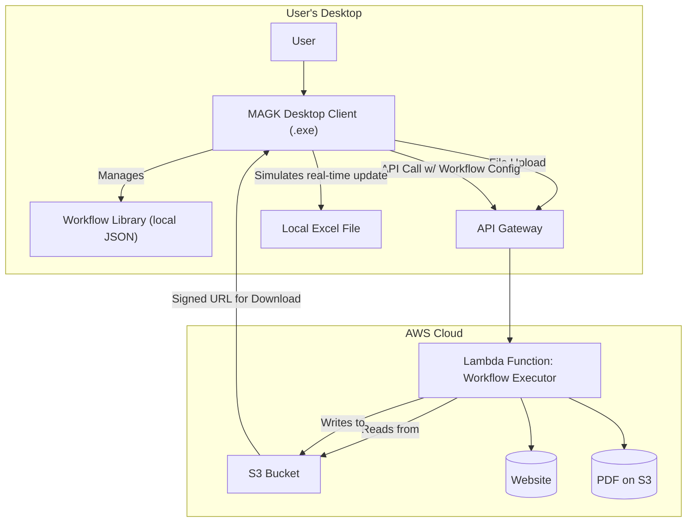

# High Level Architecture

### Technical Summary

The MAGK Demo is architected as a hybrid client-server application. A lightweight Python desktop client (PyQt) provides the chat UI and a library for saved workflows. The heavy lifting of workflow generation (using Amazon Bedrock) and data extraction is offloaded to a secure, serverless AWS backend. This separation ensures the user's machine remains responsive. For the MVP, workflows are saved to a local JSON file and run from within the main MAGK application, which preserves the "one-click" reuse goal while dramatically simplifying implementation.

### Platform and Infrastructure Choice

- **Client Platform:** Windows Desktop.
- **Cloud Platform:** AWS.
- **Key Services:**
    - AWS Lambda: To run the data extraction and processing logic.
    - AWS API Gateway: To create a secure REST API for the client.
    - AWS S3: To temporarily store uploaded source files (e.g., PDFs) and generated output files.
    - Amazon Bedrock: To provide the AI inference for chat parsing and UI generation logic.

### Repository Structure

- **Structure:** Monorepo. This will contain the code for both the desktop client and the serverless backend, simplifying dependency management and development workflow.

### High Level Architecture Diagram

### Architectural Patterns

- **Client-Server:** Separates the UI (client) from the intensive data processing (server).
- **Serverless:** Utilizes cloud functions (Lambda) to eliminate server management.
- **Request-Response:** The client will send a request and receive a final result, simplifying the flow for the MVP.

