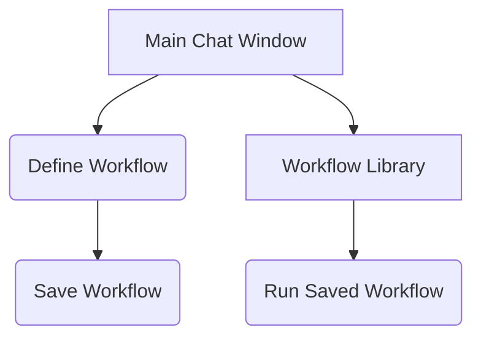

# Information Architecture (IA)

### Site Map / Screen Inventory

The application now includes a simple library to manage saved workflows.

```mermaid
graph TD
    A[Main Chat Window] --> B(Define Workflow);
    B --> C(Save Workflow);
    A --> D[Workflow Library];
    D --> E(Run Saved Workflow);

```

