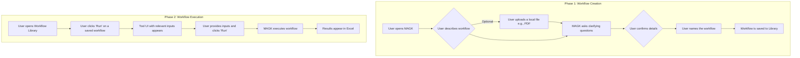

# User Flows

### Core User Flow: Workflow Definition and Execution

**User Goal:** To create a permanent, reusable automation tool from a simple conversation and run it with one click.

```mermaid
graph TD
    subgraph "Phase 1: Workflow Creation"
        A[User opens MAGK] --> B{User describes workflow};
        B -- Optional --> B1[User uploads a local file e.g., PDF];
        B1 --> C;
        B --> C;
        C[MAGK asks clarifying questions];
        C --> D{User confirms details};
        D --> E[User names the workflow];
        E --> F[Workflow is saved to Library];
    end
    subgraph "Phase 2: Workflow Execution"
        G[User opens Workflow Library] --> H[User clicks 'Run' on a saved workflow];
        H --> I[Tool UI with relevant inputs appears];
        I --> J[User provides inputs and clicks 'Run'];
        J --> K[MAGK executes workflow];
        K --> L[Results appear in Excel];
    end

```

